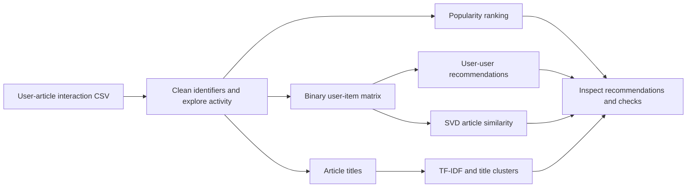

# IBM Article Recommendation System

Explore how to recommend IBM Watson Studio articles from implicit reading interactions. This notebook implements popularity ranking, user-user collaborative filtering, title-based similarity, and matrix factorization, showing how recommendation strategies use different signals.

**Focus:** Recommendation Systems · Exploratory Analysis · NLP · Matrix Factorization  
**Format:** Educational notebook with bundled data and course checks.

[Notebook](Recommendations_with_IBM.ipynb) · [Results](#results--validation) · [Run locally](#how-to-run--known-limitations)

## Features

| Approach | Implementation |
| --- | --- |
| Popularity | Rank articles by interaction counts |
| Collaborative filtering | Build a binary user-item matrix, compare users with cosine similarity, and recommend unseen articles |
| Content similarity | TF-IDF of article titles, SVD projection, and KMeans clustering |
| Matrix factorization | TruncatedSVD of the interaction matrix and article similarity exploration |

Exploratory analysis covers missing user identifiers, reading activity, and article popularity. The notebook includes assertions and course helper checks.

## Tech stack

Python · pandas · NumPy · scikit-learn · Matplotlib · Jupyter · nbconvert

## Workflow



## Results & validation

**Recorded on 2026-09-14:** all 55 analysis code cells completed sequentially on the supplied data, with no exceptions or course-helper failure messages. HTML export was checked separately and succeeded. This is the repository's existing runtime record; it was not rerun for this documentation update.

- The notebook asserts a **5,149-user × 714-article** interaction matrix.
- Recommendations and plots can be inspected in the [notebook](Recommendations_with_IBM.ipynb); a [saved HTML export](Recommendations_with_IBM.html) is also included.
- Reconstruction metrics use the matrix fitted by the model. They are in-sample diagnostics, not held-out ranking performance.

No measured lift over a popularity baseline or production engagement improvement is claimed.

## Visual preview

The notebook contains activity distributions and clustering plots. Standalone screenshots are not yet included:

| Planned image | What it should show |
| --- | --- |
| `docs/screenshots/article-activity.png` | Actual user/article activity distributions from the notebook |
| `docs/screenshots/recommendation-example.png` | A real recommendation example with its method and input |

<!-- Populate only with actual notebook output; include the run date in captions.


-->


## Contribution & attribution

The implementation described above is visible in the repository. A personal contribution breakdown is not documented; individual roles are therefore left unspecified. Existing attribution and licensing notes are preserved below.

## How to run & known limitations

Expand the original documentation below for the complete setup commands, limitations, provenance notes, and recorded verification. Its content has been preserved; the presentation update above does not introduce new runtime or benchmark claims.

<details>
<summary>Setup, limitations, and existing technical documentation</summary>

## IBM Article Recommendation Study

A notebook-based study of implicit user-article interactions for IBM Watson Studio, exploring popularity, user-user collaborative filtering, content similarity, and matrix factorization. This is an educational analysis, not a deployed service.

## Repository guide

- [Recommendations_with_IBM.ipynb](Recommendations_with_IBM.ipynb): analysis and recommendation functions.
- `data/user-item-interactions.csv` relative to the notebook working directory: interaction data.
- `project_tests.py` and `top_*.p`, where supplied: course helpers and expected answers, not disposable temporary models.

A closely related version exists in `recommendation-system`. This is now the canonical IBM project; the duplicate repository is archived. The differing checkpoint is retained.

## Setup

```bash
git clone https://github.com/iimaha-AI/Recommendation-system-IBM.git
cd Recommendation-system-IBM
python -m venv .venv
```

Activate with `source .venv/bin/activate` on macOS/Linux or `.venv\Scripts\Activate.ps1` in PowerShell, then:

```bash
python -m pip install -r requirements.txt
python -m notebook Recommendations_with_IBM.ipynb
```

The dependency list is a starting environment, not a validated lockfile. Known execution limits are listed below.


## Approach

Inspect missing users and popularity, map user IDs, build a binary user-item matrix, compare similar users, and explore content/latent-factor similarities. Functions depend on notebook state and are not yet an importable application API.

## Validation and limitations

Run from a fresh kernel in cell order. Inspect assertions and printed messages: some course helpers print incorrect-answer messages without raising exceptions. Saved output does not prove a fresh run passes.

Reconstruction metrics on the matrix used for fitting are in-sample diagnostics, not held-out recommendation benchmarks. Add a held-out interaction split, popularity baseline, Recall@K/NDCG@K, coverage, and cold-start evaluation. Clustering and exact-neighbor assertions may vary with initialization and library versions.

## Next development steps

- See [review notes](docs/REVIEW.md) for historical findings; current runtime verification is below.
- Extract pure recommendation functions and test unknown users, empty histories, and duplicate recommendations.
- Lock dependencies after an end-to-end run and publish a small demo with reproducible results.

## Attribution

Based on Udacity Data Scientist Nanodegree material and IBM Watson Studio interaction data. No standalone license file is present; confirm distribution rights before adding one. Data licensing is separate from code licensing.

## Recorded verification

On 2026-09-13, 55 analysis code cells completed in order in the audit environment without an exception. HTML export was excluded; no held-out quality claim follows from this execution. See [environment and validation scope](docs/REVIEW.md).

## Runtime repair — 2026-09-14

All 55 analysis code cells completed sequentially on the supplied data, with no exception or course-helper failure messages. HTML export was tested separately and succeeded. The export cell now uses the notebook kernel’s Python interpreter (`python -m nbconvert`); `nbconvert` is explicit in requirements.

Tested with Python 3.12, NumPy 2.5.3, pandas 2.3.3, scikit-learn 1.9.1, IPython and nbconvert 7.17.1. Plots used Agg. This is runtime verification, not held-out recommendation quality. Run from the repository directory. A full dependency lock and held-out ranking evaluation remain future work.

</details>
